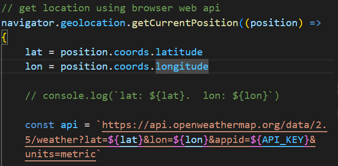

# 🌤️ TempTrack - Weather Forecast App

    Temptrack is a simple weather forecast web app that provide current weather forecast, weather forecast of next 18 hours (Split 6hours apart), and forecast of next 5 day.

# 🛠️ Features :

    - Current weathear details (temperature, main weather, humidity, wind, rain, cloud coverage).

    - Search weather by city name.
        - I am using 'Bengaluru' as default city to get weather forecast

    - Search weather by User location.
        - using web api geolocation, get current position(latitude and longitude) of the user.

        - later pass the latitude and longitude to api that used lat and lon to fetch weather forecast data.

        
        
        

